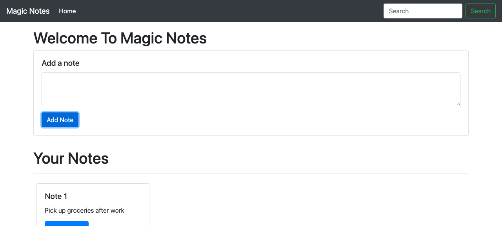

# Magic Notes

A simple note-taking app: write notes, they show up on the page, and search filters them. Notes persist in the browser's local storage.

## Stack

- HTML5, CSS3, Bootstrap
- JavaScript (Vanilla)

## Run it

Open `index.html` in a browser.

## Screenshot

## License

MIT - see [LICENSE](LICENSE).
